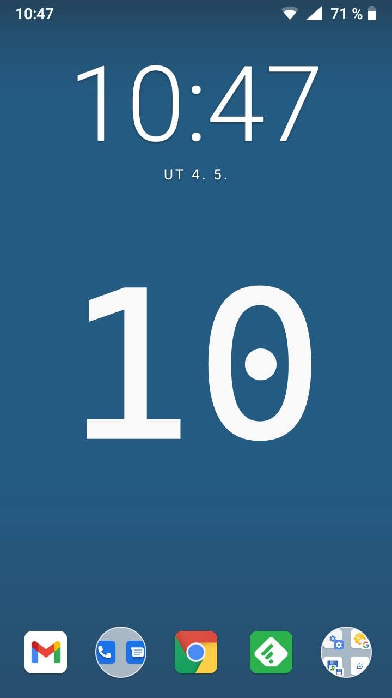

# data-livewallpaper
Unlock Clock 
- ##### Based on *[googlecreativelab/digital-wellbeing-experiments-toolkit](https://github.com/googlecreativelab/digital-wellbeing-experiments-toolkit/tree/master/liveWallpaper)*
- ##### Changed *background color : #245b82* 
- ##### Changed *[font : cascadia-code](https://github.com/microsoft/cascadia-code)* (SIL Open Font License 1.1)
- #####  

 
